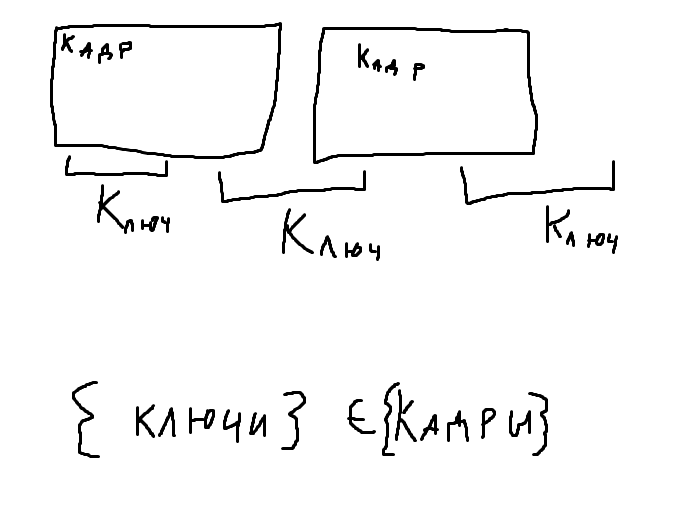
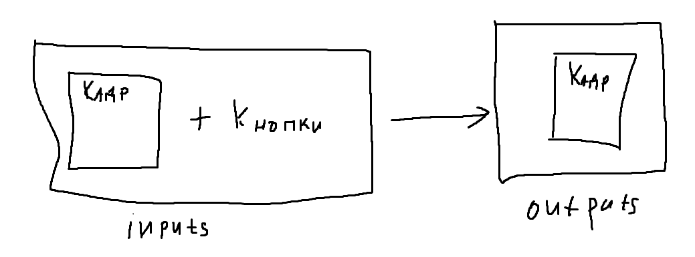

# Описываю свою работу

## Направления развития:
- обработать данные
- улучшить слои(использовать диффузионную модель? Модель EDM?)
- сделать демонстрационный вывод генерации
- переработать структуру проекта(сделать несколько модулей для обучения, обработки данных и тд)
- сделать сжатие данных до входа в модель и возвращение после(по аналогии с stable diffusion)

## Обработка данных

Для правильного обучения нейронной сети необходимо правильно собрать и обработать данные.

Изображения(цвета в каждом пикселе) + нажатия клавиш(номер клавиши в кодировке)

Есть варианты соединения:
- каждому кадру — все клавиши, которые были нажаты(могут быть пересечения)(подходит, если кадры медленнее считываются, чем нажатия)
- одному кадру — одно нажатие(для синхронизации)(брать самое длинное по времени нажатие клавиши)
- убирать лишние кадры, если нажатия редкие

Без соединения, можно сохранять время кадра и нажатия, но предсказывать будет сложнее.

Может использовать порядок для обозначения связи?

Так как в процессе генерации может быть задействовано несколько клавиш, то единственный оставшийся вариант — каждому кадру соответствие множества клавиш.

Для автоматического совмещения можно или изменить способ сбора данных в датасет(вместо obs для записи включить сохранение фото в python скрипт или подобный), или совмещать на пост обработке, уже после преобразования видео в кадры и сбора отдельно клавиш.

Для 1го способа нужно сделать новый скрипт для сбора и обработки фото и клавиш.
Для 2го способа нужно сделать только скрипт для пост обработки, что легче, чем для 1го способа.

Возможно использовать формат данных hdf5(по аналогии с diamond)

Данные для обучения будут в виде цветов пикселей изображения вместе с вектором, обозначающим нажата ли была какая-либо кнопка.

Надо сделать программу для сбора данных для обучения. +

Надо объединить сбор данных в основной модуль.